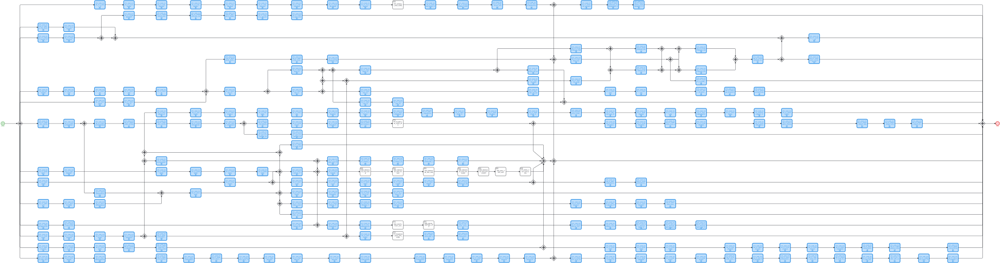
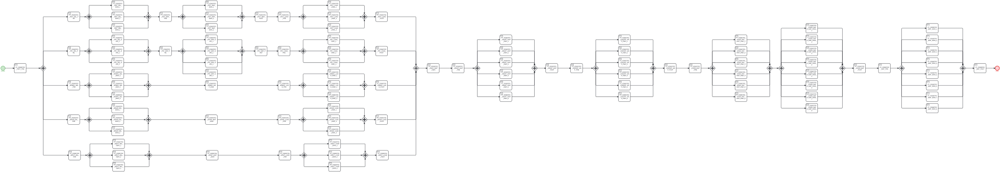
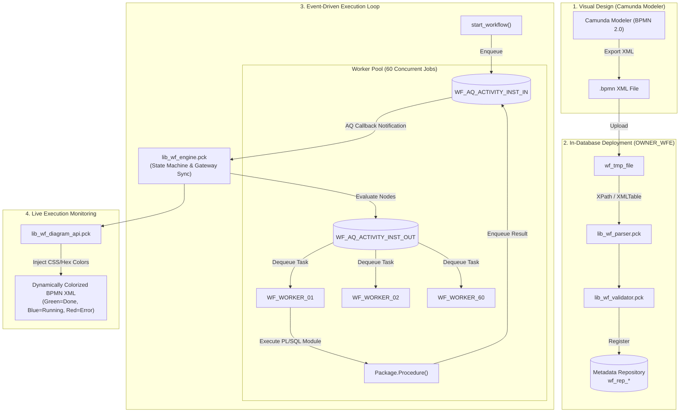
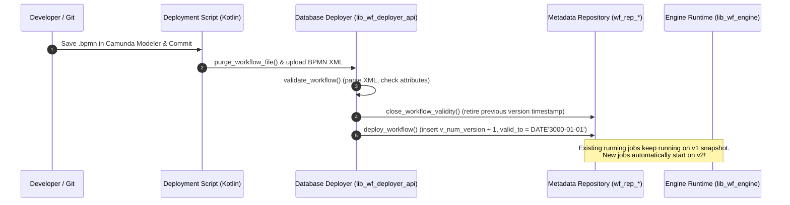

# Oracle Workflow Engine

[](https://www.oracle.com/database/technologies/appdev/plsql.html)
[](https://www.omg.org/spec/BPMN/2.0/)
[](https://camunda.com/download/modeler/)
[-green.svg)](https://docs.oracle.com/en/database/oracle/oracle-database/19/adque/index.html)
[](LICENSE)

A high-performance, lightweight, and completely license-free **Workflow Engine** implemented natively inside **Oracle Database (PL/SQL)** using **Oracle Streams Advanced Queuing (DBMS_AQ)**, designed to execute pipelines visually modeled in **Camunda Modeler** (supporting the core BPMN 2.0 DAG execution subset).

Originally designed and deployed in production to replace deprecated, legacy workflow software (**Oracle Workflow / OWF**), this engine enabled an enterprise data warehouse to seamlessly upgrade its core database from **Oracle 11g to Oracle 19c**.

Engineers could visually design massive DAG pipelines in **Camunda Modeler**, deploy the raw BPMN XML directly into the database, and execute thousands of dependent ETL transformations with 100% transactional ACID consistency and zero external middleware runtime dependencies.

---

## The Business Challenge: Unblocking Oracle 11g to 19c Upgrade

When planning the mission-critical database upgrade from **Oracle 11g to Oracle 19c**, the data warehouse team hit a hard roadblock: **Oracle Workflow (OWF) was officially desupported and removed in Oracle 19c**. 

The existing data warehouse relied on OWF to coordinate over 20,000 ETL procedures across 100+ daily loading pipelines. Migrating away from OWF presented two undesirable options:

1. **Adopt Commercial Middleware (Oracle SOA Suite / BPM Suite)**:
   - Exorbitant per-CPU core licensing and annual maintenance costs.
   - Significant infrastructure overhead (WebLogic application servers, operational administration).
   - Network latency between external middleware and the database engine.
2. **Stick with Outdated Database Versions**:
   - Security vulnerabilities and loss of Oracle Premier Support on 11g.

### The Innovation: An In-Database BPMN 2.0 Engine
Rather than introducing external middleware monsters or paying massive license fees, this custom engine was built directly inside Oracle PL/SQL:
- **Unblocked the 19c Upgrade**: Replaced OWF with a modern, database-native engine that runs seamlessly on Oracle 19c.
- **Zero Performance Penalty**: Maintained raw in-database execution speed by running orchestration directly where the data lives, eliminating network hops.
- **Modernized Developer Ergonomics**: Replaced the legacy, 1990s-era Oracle Workflow Builder desktop client with modern, web-standard **Camunda Modeler (BPMN 2.0)**.
- **Saved Significant Licensing Costs**: 100% license-free and free of external runtime dependencies.

### Design Philosophy: Squeezing Platform ROI vs. Adding Middleware Lock-In
A common question in enterprise system design is: *"Why not adopt an off-the-shelf external workflow tool (e.g. Airflow, Control-M, or Oracle SOA Suite)?"*

The decision to build an in-database engine was driven by real-world enterprise economics:
1. **The Reality of Existing Platform Commitment**: With 20,000+ stored procedures, extensive partitioning, and multi-terabyte loads, the core data warehouse was already deeply invested in Oracle. Introducing an external scheduler would not have removed platform lock-in—it would have simply added a **second vendor bill**, a second infrastructure silo, and another operational team.
2. **Data-Locality Beats Network Overhead**: Moving orchestration *to* the data instead of moving control messages *across* networks eliminated connection pool exhaustion, network timeouts, and serialization overhead.
3. **Maximizing Already-Purchased Capabilities**: Oracle Database already included high-performance, kernel-level queuing (**DBMS_AQ**), in-memory execution, and robust XML parsing (**XMLTABLE**). Building this engine leveraged capabilities the organization had already paid for, unlocking maximum ROI from existing enterprise database hardware.

---

## Production Scale & Impact

This engine was the core orchestration backbone for an enterprise Data Warehouse:

| Metric | Production Scale | Description |
| :--- | :--- | :--- |
| **Concurrent Execution** | **60 parallel worker jobs** | 60 background processes concurrently consuming from Oracle AQ queues to execute up to 60 heavy parallel SQL transformations simultaneously without blocking. |
| **Stored Procedures** | **20,000+ procedures** | Each procedure represented an atomic, audited step in the data pipeline (extract, transform, validate, aggregate, load). |
| **Source Systems** | **50+ upstream platforms** | Orchestrated heterogeneous feeds from core banking, CRM, debt collection, partner networks, and web services. |
| **Load Pipelines** | **100+ daily batch processes** | Ranging from quick incremental loads to massive enterprise DAGs. |
| **Flagship Complexity** | **`ETL_CORE_PIPELINE`** | Hundreds of concurrent nodes, multi-stage parallel gateway forks and joins, nested call activities, and conditional branches. |
| **Infrastructure Overhead** | **0 external servers** | Runs 100% in-database. Eliminates external orchestrator licensing, JVM middleware drift, and network serialization hops. |

---

## Real-World Pipeline Topology

Below are production-grade pipeline DAGs designed visually in **Camunda Modeler** and executed natively inside Oracle Database by this engine. The complete, runnable `.bpmn` source models are available in the [`samples/`](samples/) directory:

### 1. Stage Pipeline Orchestration DAG (`ETL_SUB_CORE`)
Covers an enterprise data staging and core loading phase. Demonstrates multi-stage parallel gateway forks and joins, synchronizing dozens of concurrent ETL tasks, nested sub-processes (`Call Activities`), and procedure invocations (`Receive Tasks`):



*Source model: [`samples/ETL_SUB_CORE.bpmn`](samples/ETL_SUB_CORE.bpmn)*

### 2. Partitioned Worker Sub-Process (`ETL_SUB_CORE_FT_DEBT_PD_MAP`)
Demonstrates fine-grained parallel worker execution inside a single fact table pipeline. Slices heavy transformations into parallel partition streams (`_DWH_1` through `_DWH_8`), flanked by pre-load initialization and post-load validation steps, executed concurrently across the 60 Oracle AQ background workers:



*Source model: [`samples/ETL_SUB_CORE_FT_DEBT_PD_MAP.bpmn`](samples/ETL_SUB_CORE_FT_DEBT_PD_MAP.bpmn)*

---

## Architectural Overview



### Key Architectural Pillars:

1. **Native BPMN 2.0 XML Parser (`lib_wf_parser.pck`)**:
   - Uses Oracle `XMLTABLE` and `XMLNAMESPACES` to unpack process elements, sequence flows, conditional expressions, diagram coordinate shapes, and Camunda extension parameters directly into relational tables without third-party XML libraries.
2. **Asynchronous Non-Blocking Queuing (`lib_wf_queue.pck`)**:
   - Utilizes Oracle Advanced Queuing (`DBMS_AQ`) with asynchronous PL/SQL callback registrations (`sys.aq$_reg_info`). When an event occurs, Oracle AQ immediately wakes up the engine callback, avoiding wasteful polling loops.
3. **Parallel Gateway Fork & Join Synchronization (`lib_wf_engine.pck`)**:
   - Handles true parallel execution. When parallel branches fork, each branch proceeds concurrently. At the joining parallel gateway, `is_parallel_gateway_complete` atomically evaluates the arrival of all incoming sequence flows before releasing downstream tasks.
4. **Dynamic Visual Feedback (`lib_wf_diagram_api.pck`)**:
   - Reconstructs the BPMN XML at runtime and dynamically injects stroke/fill styling into the diagram elements based on historical and real-time execution states:
     - 🟢 **Green** (`rgb(67, 160, 71)`): `COMPLETE`
     - 🔵 **Blue** (`rgb(30, 136, 229)`): `RUNNING`
     - 🔴 **Red** (`rgb(229, 57, 53)`): `ERROR`
     - 🟡 **Yellow** (`rgb(255, 225, 0)`): `RESTART` / `SKIP`
5. **Zero-Downtime Hot Deployments (`lib_wf_deployer_api.pck`)**:
   - Implements Slowly Changing Dimension Type 2 (SCD2) temporal versioning (`num_version`, `dtime_valid_from`, `dtime_valid_to`). Active, running pipelines stay locked to their execution snapshot (`id_workflow_definition`), while new runs automatically bind to the newest version. Deployments can occur in the middle of active batch loads with zero downtime.

---

## Zero-Downtime Hot Deployments & CI/CD



### Key Deployment Characteristics:
- **Zero Middleware Server Footprint**: The team originally evaluated running full Camunda Server (JVM), but writing this database engine eliminated the need for any external engine. Only the free, standalone **Camunda Modeler** desktop app was needed to author standard `.bpmn` files.
- **Lightweight CI/CD Automation**: A Kotlin deployment script picked up changed `.bpmn` files from repository directories and called the `lib_wf_deployer_api` stored procedures via JDBC.
- **SCD-2 Version Isolation**:
  - Previous versions are timestamped: `dtime_valid_to = SYSDATE - INTERVAL '1' SECOND`.
  - The new version is published with `dtime_valid_to = DATE'3000-01-01'`.
  - Running workflow instances continue undisturbed against their original version snapshot.
  - New pipelines immediately pick up the latest definitions without requiring downtime or service restarts.

---

## Two-Tier System Architecture

The project is structured into two complementary database schemas:

### 1. `OWNER_WFE` — The Core BPMN Engine
The generic, reusable workflow engine that implements BPMN 2.0 semantics:
- **`lib_wf_parser`**: Unpacks BPMN 2.0 XML definitions and diagram geometry into relational structures.
- **`lib_wf_validator`**: Validates workflow topologies (connectivity, mandatory attributes, acyclic rules) before deployment.
- **`lib_wf_deployer_api`**: Manages deployment revisions, versioning, and rollback.
- **`lib_wf_engine`**: The central state machine. Evaluates incoming tokens, manages task lifecycle, and coordinates gateway joins.
- **`lib_wf_queue` / `lib_wf_queue_api`**: Enqueues and dequeues activity instances across inbound/outbound queues.
- **`lib_wf_diagram_api`**: Generates executed BPMN XML with real-time status highlights for visual observability.

### 2. `OWNER_WFM` — The Enterprise Workflow Manager & ETL Orchestrator
The enterprise orchestration layer that connects the workflow engine to business transformations:
- **`lib_etl_process_run` / `lib_etl_process_run_api`**: Main process execution engine with schedule windows, automatic triggering, manual restarts, task skipping, and cancellation.
- **`lib_etl_workflow_queue`**: Manages the pool of 60 background worker jobs (`WF_WORKER_X`) dequeuing executable modules and executing PL/SQL procedures.
- **`lib_etl_process_monitoring`**: Real-time SLA monitoring, tracking runtimes, detecting hung sessions, and alerting.
- **`lib_etl_bg_process_run`**: Manages Oracle Scheduler jobs that keep worker queues alive and health-checked.

---

## BPMN 2.0 Elements Supported

| Element | Camunda Visual | Engine Semantics |
| :--- | :--- | :--- |
| **Start Event** | Green Circle | Initializes the workflow instance, instantiates variables, and starts root sequence flows. |
| **End Event** | Red Circle | Finalizes instance tokens. If running inside a `Call Activity`, notifies the parent workflow. |
| **Receive Task (Procedure)** | White Rectangle (Letter) | Calls an atomic database procedure. Dispatched to the worker queue via `MODULE_NAME` input parameter. |
| **Receive Task (Function)** | Orange Rectangle | Evaluates a database function returning a string (up to 100 chars) used for conditional branching. |
| **Call Activity** | Blue Rectangle (Plus sign) | Hierarchical sub-process invocation. Executes nested `.bpmn` definitions with isolated token spaces. |
| **Parallel Gateway** | Rhombus with `+` | **Fork**: Splits single token into $N$ concurrent parallel flows.<br/>**Join**: Atomic barrier synchronization; waits for all incoming flows. |
| **Inclusive Gateway** | Rhombus with `O` | Conditional branching (`IF - ELSIF - ELSE`) based on evaluated expressions. |
| **Catch Timer Event** | Circle with Clock | Suspends activity execution for a specified duration using standard ISO 8601 formatting. |
| **Sequence Flow** | Directional Arrow | Defines dependencies, passing parameters and condition expressions between activities. |

---

## Hierarchical Pipeline Modeling Standard

Workflows follow a clean 3-level hierarchical decomposition:

1. **Level 1 — Main Pipeline (`ETL_MAIN_CORE.bpmn`)**:
   - Represents the top-level orchestration process. Coordinates high-level warehouse stages sequentially and in parallel via `Call Activity` nodes.
2. **Level 2 — Stage Sub-Process ([`samples/ETL_SUB_CORE.bpmn`](samples/ETL_SUB_CORE.bpmn))**:
   - Orchestrates domain-specific dependencies (e.g., source staging, fact processing, aggregations) using parallel gateways, timer catches, and conditional checks.
3. **Level 3 — Atomic Module Execution ([`samples/ETL_SUB_CORE_FT_DEBT_PD_MAP.bpmn`](samples/ETL_SUB_CORE_FT_DEBT_PD_MAP.bpmn))**:
   - Slices table transformations into concurrent partition streams (`Receive Task` with `MODULE_NAME`), invoking stored procedures directly across parallel worker queue jobs.

---

## Example: Interactive Test Execution (`deployment_plan.txt`)

You can control workflow instances directly via PL/SQL:

```sql
DECLARE
  v_id_workflow_instance INTEGER;
BEGIN
  -- Start a new workflow instance
  owner_wfe.lib_wf_engine_api.start_workflow(
    p_name_workflow        => 'MAIN_PIPELINE_WORKFLOW',
    p_id_process_instance  => 1,
    p_date_effective       => TRUNC(SYSDATE),
    p_num_process_priority => 1,
    p_id_workflow_instance => v_id_workflow_instance
  );
END;
/

-- Suspend a running workflow
BEGIN
  owner_wfe.lib_wf_engine_api.suspend_workflow(p_id_workflow_instance => 736);
END;
/

-- Resume a suspended workflow
BEGIN
  owner_wfe.lib_wf_engine_api.resume_workflow(p_id_workflow_instance => 736);
END;
/

-- Skip a failed activity and advance the pipeline
BEGIN
  owner_wfe.lib_wf_engine_api.skip_workflow_activity(
    p_id_workflow_activity_inst => 3498,
    p_date_effective            => DATE'2020-05-28'
  );
END;
/
```

---

## Monitoring & Diagnostic Queries

Inspect runtime status, queues, and history at any time:

```sql
-- 1. Check actively running instances
SELECT * FROM owner_wfe.wf_run_instance;
SELECT * FROM owner_wfe.wf_run_activity_instance;

-- 2. Inspect Inbound & Outbound Oracle AQ queues
SELECT * FROM owner_wfe.wf_aq_activity_inst_in;
SELECT * FROM owner_wfe.wf_aq_activity_inst_out;

-- 3. Review process history and execution durations
SELECT name_workflow, code_status, dtime_start, dtime_end
FROM owner_wfe.wf_hist_instance
ORDER BY dtime_start DESC;

-- 4. Check error and audit event logs
SELECT * FROM owner_wfe.wf_log_event ORDER BY dtime_inserted DESC;
```

---

## Repository Structure

The codebase is organized according to enterprise database standards, clearly separating one-time database provisioning from recompilable application code:

```
workflow-engine/
├── install/                        # --- ONE-TIME SETUP & DDL SCRIPTS ---
│   ├── 01_sys_init.sql             # Creates tablespaces, user, AQ grants (run as SYS/DBA)
│   ├── 99_cleanup.sql              # Teardown / cleanup script
│   ├── owner_wfe/                  # Schema: OWNER_WFE (Core Engine)
│   │   ├── tables/                 # Table DDLs (wf_rep_*, wf_hist_*, wf_run_*, etc.)
│   │   ├── sequences/              # Sequence DDLs (s_*)
│   │   ├── queues_and_types.sql    # Oracle AQ Queue table, queues & object types
│   │   ├── queues_subscriber.sql   # AQ notification subscriber registration
│   │   ├── grants.sql              # Schema execute & select privileges
│   │   ├── alter.sql               # Schema alters
│   │   └── initial_deploy.sql      # Seed query for initial deployment
│   └── owner_wfm/                  # Schema: OWNER_WFM (Manager / Orchestrator)
│       ├── seed_data.sql           # Initial configuration parameters
│       └── grants.sql              # Schema privileges
│
├── source/                         # --- REPEATABLE / RECOMPILABLE CODE ---
│   ├── owner_wfe/                  # Core Engine
│   │   ├── packages/               # lib_wf_*.pck (10 engine packages)
│   │   └── views/                  # v_wf_*.vw    (4 engine views)
│   └── owner_wfm/                  # Workflow Manager & Orchestrator
│       ├── packages/               # lib_etl_*.pck (20 manager packages)
│       ├── views/                  # v_etl_*.vw    (13 manager views)
│       └── triggers/               # trg_etl_*.trg (14 audit/log triggers)
│
├── samples/                         # --- SAMPLE BPMN 2.0 MODELS ---
│   ├── ETL_SUB_CORE.bpmn            # Level 2: Stage Sub-Process DAG
│   └── ETL_SUB_CORE_FT_DEBT_PD_MAP.bpmn # Level 3: Partitioned worker sub-process
│
├── tests/                          # --- TESTING & RUNTIME VERIFICATION ---
│   └── test_runner.sql             # Interactive PL/SQL blocks to start, pause, resume & skip
│
├── docs/                           # Documentation assets & vector diagrams
│   ├── etl_sub_core_diagram.svg    # Vector diagram export of ETL_SUB_CORE
│   └── etl_sub_core_debt_diagram.svg # Vector diagram export of worker sub-process
└── README.md
```

---

## License

This project is licensed under the [MIT License](LICENSE) — free for use, modification, and distribution.
